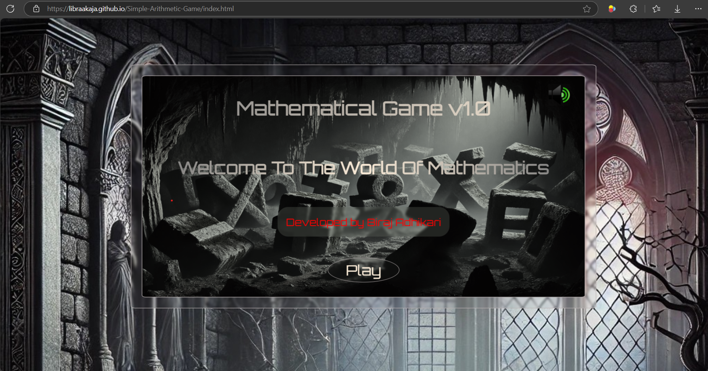
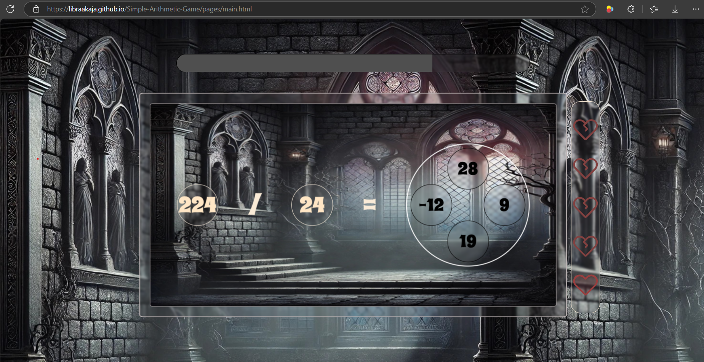
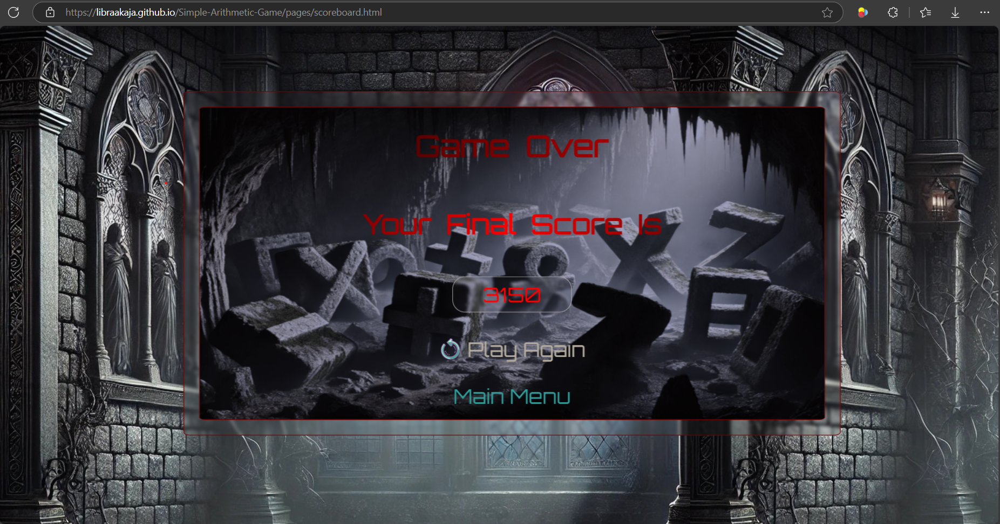

# Simple Mathematics Game

A simple arithmetic addition, subtraction, multiplication and division game created using **HTML**, **CSS**, and **JavaScript**.

## 🌟 Features

- **Multi-page Layout**: Includes structured pages for a complete user experience.
- **Custom Styling**: Designed with CSS for an attractive user interface.
- **Fully responsive**: Works smoothly across different devices.
- **Simple UI**: Clean and intuitive design for easy use.
- **Playable on GitHub Pages**: No installation needed!

## 🗃️ Folder Structure

Simple-Arithmetic-Game/ <br>
├── assets/       # Contains images and sounds for game<br>
├── css/          # Contains all css files<br>
├── pages/        # Contains html files<br>
├── scripts/      # Contains all js files<br>
├── index.html <br>
├── README.md  <br>

## 🌐 Live Demo
[Play Now](https://LibraAkaja.github.io/Simple-Arithmetic-Game/) 🎲

## 📦 How to Run

1. Clone this repository:
   ```bash
   git clone https://github.com/LibraAkaja/Simple-Arithmetic-Game.git

2. Navigate to the project folder
   ```bash
   cd Simple-Arithmetic-Game

3. Open the index.html file in your browser.

## Technologies Used

- HTML
- CSS
- JavaScript

## Screenshots




## Acknowledgements
- Icons by [Icon Finder](https://www.iconfinder.com/)
- Sounds by [Pixabay](https://pixabay.com/)
- The images used in this project were AI generated

## 🤝 Contributing
This project is currently **not open for contributions**. If you have any suggestions or feedback, feel free to open an issue.

## 🚫 License
This project is for personal or educational use only. Redistribution or commercial use is not allowed.

## 📞 Contact
For any inquiries or feedback, feel free to reach out:  
- 📧 **Email:** [adhikaribiraj908@gmail.com](mailto:adhikaribiraj908@gmail.com)  
- 🔗 **GitHub Issues:** [Report a Bug or Suggest a Feature](https://github.com/LibraAkaja/Simple-Arithmetic-Game/issues)  
